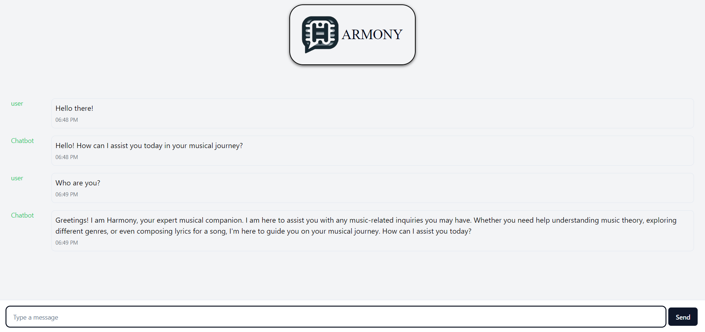

## Musical Chatbot - Harmony

### Build your own musical chatbot with custom interface on top of ChatGPT

Technology Used:
- LangChain (Prompt Optimization)
- Chainlit (Backend)
- React (Custom UI)
- LLM (ChatGPT)



To use ChatGPT, you can generate api key by signing up here: https://platform.openai.com/overview

----------------------------------------------------------------
From the root directory move to `chainlit-backend` folder. In `app.py` file enter your OpenAI API key
```python
OPENAI_KEY = 'openai_api_key' # Enter your key here
``` 

Now on the command line enter the following command to run the backend
```bash
chainlit run app.py
```

To have a custom user interface, change the directory to `frontend` 
```
cd frontend
```
Now run the following command
```bash
npm run dev
```


